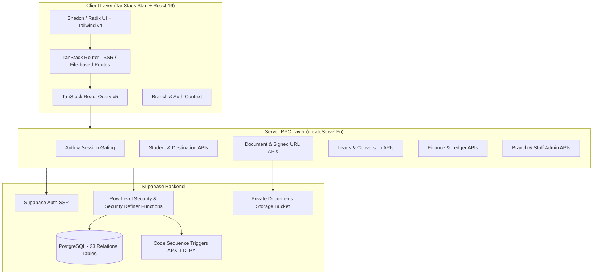
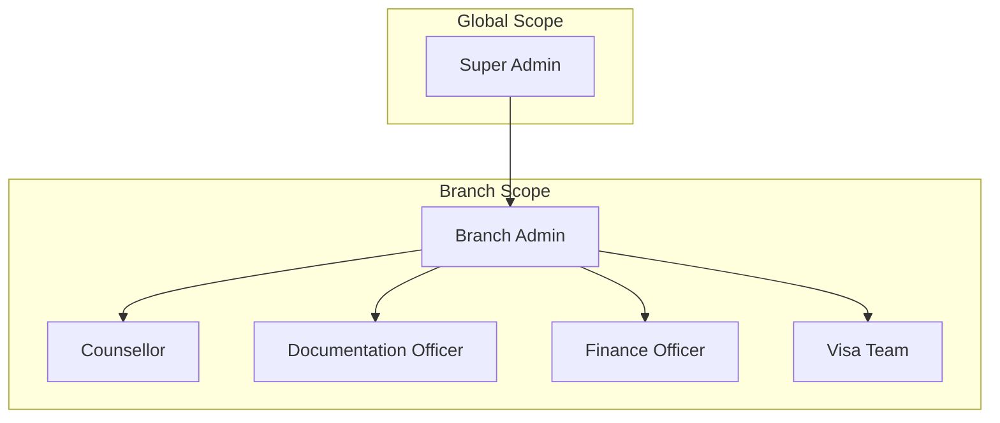

# APEX Abroad Consultancy — Admin Portal (CRM)

An enterprise-grade internal CRM and casework management platform designed for study-abroad visa consultancies. Built with **TanStack Start**, **React 19**, **Tailwind CSS v4**, and **Supabase PostgreSQL**, this portal powers multi-branch operations, student lifecycle tracking, multi-country checklist compliance, financial ledgering, and role-based staff workflows.

> [!NOTE]
> This platform is an internal operations portal for consultancy staff, counsellors, documentation officers, and branch managers. It is connected to [Lovable](https://lovable.dev) and backed by a live Supabase PostgreSQL database with full Row Level Security (RLS).

---

## Key Highlights

- **Multi-Tenant Branch Architecture**: Real-time branch switching with branch-scoped data isolation and multi-branch staff assignment.
- **Full Student Casework Lifecycle**: End-to-end management from lead capture and one-click conversion to visa approval and enrolment.
- **Multi-Country Destination Checklists**: Automated admission and visa compliance checklists dynamically seeded for target countries (UK, USA, Canada, Australia, Germany, etc.).
- **Role-Based Access Control (RBAC)**: Fine-grained permissions across 6 distinct roles (`Super Admin`, `Branch Admin`, `Counsellor`, `Documentation Officer`, `Finance`, and `Visa Team`).
- **Secure Document Management**: Client-to-storage file uploads with private bucket storage and time-limited signed URL generation for document verification.
- **Multi-Currency Finance Ledger**: Tracking of payments, installments, auto-generated receipt numbers (`PY-####`), exchange rates, and refund approvals.
- **Immutable Audit Trail**: Global timeline tracking all mutations with staff attribution, branch context, and change metadata.

---

## System Architecture



---

## Core Features & Modules

### 1. Dashboard & Operational Analytics

- **Executive KPIs**: Real-time indicators for Total Students, Active Applications, Pending Documents, Deadlines, and Success Rates.
- **Admissions Momentum & Geography**: Interactive area charts for monthly intake trends and pie charts for target destination distribution.
- **Daily Operations**: Staff task checklist, urgent deadline tracker, and quick-action shortcuts.

### 2. Multi-Branch & Multi-Tenant Management

- Global branch selector with immediate context switching across locations (e.g., Hyderabad Head Office, Somajiguda, Madhapur, Warangal, Karimnagar).
- Branch-level security isolation enforced via the `has_branch_access(auth.uid(), branch_id)` Postgres security definer function.
- Branch administration interface to create, modify, or archive branches.

### 3. Student Casework & Lifecycle

- **Unified Identifier Sequence**: Collision-resistant sequence generator for student codes (`APX-####`).
- **360° Student File**: Detailed records covering personal info, academic history, test scores (IELTS/TOEFL/GRE), passport data, and financial profiles.
- **Multi-Destination Support**: Attach multiple target countries per student, each with independent university preferences, intakes, and checklist states.

### 4. Admission & Visa Compliance Checklists

- Pre-configured checklist templates for major study destinations (UK, USA, Canada, Australia, Germany).
- Document lifecycle statuses: `Pending`, `Received`, `Approved`, `Rejected`, and `Waived`.
- Reusable template builder for super administrators to adjust country-level requirements.

### 5. Document Verification & Private Storage

- Direct uploads to private Supabase Storage buckets.
- Time-limited (5-minute expiry) signed URL generation for secure document inspection.
- Officer review notes and status updates directly on student casework profiles.

### 6. Leads Pool & One-Click Conversion

- Incoming lead pipeline with source attribution, intended intake, and priority scoring (`LD-####`).
- Atomic lead-to-student conversion: automatically spins up a casework file, assigns branch and counsellor, instantiates checklist items, and archives the lead enquiry.

### 7. Applications Kanban Pipeline

- Visual stage tracker from initial intake through final enrollment:
  $$\text{Counselling} \longrightarrow \text{Shortlisting} \longrightarrow \text{Document Prep} \longrightarrow \text{Applied} \longrightarrow \text{Offer Received} \longrightarrow \text{Visa Processing} \longrightarrow \text{Enrolled}$$
- Drag-and-drop stage updates with automatic history logging.

### 8. Payments, Receipts & Refund Management

- Multi-currency payment logging with automatic receipt sequencing (`PY-####`) and exchange rate capture.
- Installment breakdown, pending balance computations, and receipt downloads.
- Structured refund workflow with managerial approval tracking and transaction reference recording.

### 9. Staff Directory & Global Audit Trail

- Staff directory supporting multi-branch assignment chips, status activation toggles, and role badges.
- Append-only audit log tracking user ID, branch context, timestamp, action type, and payload details.

---

## Technology Stack

| Layer                  | Technology                                                                                                                                                         |
| ---------------------- | ------------------------------------------------------------------------------------------------------------------------------------------------------------------ |
| **Framework**          | [TanStack Start v1](https://tanstack.com/start) (Full-stack SSR React Framework)                                                                                   |
| **Frontend UI**        | [React 19](https://react.dev/), [Tailwind CSS v4](https://tailwindcss.com/), [Radix UI Primitives](https://www.radix-ui.com/), [Lucide Icons](https://lucide.dev/) |
| **Type-Safe Routing**  | [TanStack Router](https://tanstack.com/router) with automatic route-tree generation                                                                                |
| **Data Management**    | [TanStack React Query v5](https://tanstack.com/query)                                                                                                              |
| **Data Visualization** | [Recharts](https://recharts.org/)                                                                                                                                  |
| **Backend & DB**       | [Supabase](https://supabase.com/) PostgreSQL (23 relational tables, RLS, DB triggers & sequences)                                                                  |
| **Authentication**     | Supabase Auth SSR with session cookie management and route-level redirection                                                                                       |
| **File Storage**       | Supabase Storage (Private document bucket with signed URL access)                                                                                                  |
| **Server RPC**         | TanStack Start `createServerFn` type-safe server endpoints                                                                                                         |
| **Form Management**    | React Hook Form & Zod validation                                                                                                                                   |
| **Build & Tooling**    | [Vite 8](https://vitejs.dev/), TypeScript 5.8, ESLint, Prettier                                                                                                    |

---

## Project Structure

```
abroad-apex-hub/
├── .agents/                      # Custom Agent skills & configurations
├── docs/
│   └── BACKEND-INTERACTION-MAP.md# Comprehensive API interaction blueprint
├── public/                       # Static public assets & favicon
├── src/
│   ├── components/
│   │   ├── crm/                  # CRM modals & data components (NewStudentModal, RecordPaymentModal, etc.)
│   │   ├── layout/               # AppShell, AppSidebar, TopBar
│   │   └── ui/                   # Reusable Shadcn / Radix UI primitives
│   ├── data/                     # Seed templates & domain definitions
│   ├── hooks/                    # Custom React utility hooks
│   ├── integrations/
│   │   └── supabase/             # Supabase browser client initialization
│   ├── lib/
│   │   ├── api/                  # TanStack Start type-safe server functions (createServerFn)
│   │   │   ├── activity.ts       # Audit trail query endpoints
│   │   │   ├── applications.ts   # Applications & stage transitions
│   │   │   ├── branches.ts       # Branch CRUD & archiving
│   │   │   ├── dashboard.ts      # KPI aggregation & chart metrics
│   │   │   ├── destinations.ts   # Student destination & checklist mutations
│   │   │   ├── documents.ts      # Document record creation & signed URLs
│   │   │   ├── leads.ts          # Lead pool CRUD & student conversion
│   │   │   ├── payments.ts       # Ledger, receipts & refunds
│   │   │   ├── settings.ts       # Fee templates & org configuration
│   │   │   ├── staff.ts          # Staff directory & status management
│   │   │   └── students.ts       # Student casework CRUD & profiles
│   │   ├── context/              # App & Branch React Context Provider
│   │   ├── supabase/             # Supabase server client, client singleton & generated types
│   │   └── auth.ts               # Server session retrieval & user profile resolution
│   ├── routes/                   # File-based TanStack Start routes
│   │   ├── __root.tsx            # Root layout, theme injection, and session gating
│   │   ├── index.tsx             # Main dashboard
│   │   ├── login.tsx             # Staff authentication
│   │   ├── students.index.tsx    # Student list with filters & search
│   │   ├── students.$id.tsx      # Comprehensive 360° student casework view
│   │   ├── leads.tsx             # Lead management pool
│   │   ├── applications.tsx      # Kanban board for application stages
│   │   ├── payments.tsx          # Financial ledger & receipt viewer
│   │   ├── staff.tsx             # Staff management directory
│   │   ├── branches.tsx          # Multi-branch admin interface
│   │   ├── activity.tsx          # Global audit activity log
│   │   ├── reports.tsx           # Admissions & branch performance reports
│   │   └── settings.tsx          # Platform settings & fee catalog
│   ├── router.tsx                # TanStack Router instance creation
│   ├── server.ts                 # Nitro server entrypoint
│   ├── start.ts                  # Client hydration start script
│   └── styles.css                # Global theme tokens, typography, and animations
├── package.json
├── tsconfig.json
└── vite.config.ts
```

---

## Getting Started

### Prerequisites

- [Node.js](https://nodejs.org/) (version 18.x, 20.x, or higher)
- [npm](https://www.npmjs.com/) or [Bun](https://bun.sh/)
- A [Supabase](https://supabase.com/) project (if running a custom instance)

### Installation

1. **Clone the repository:**

   ```sh
   git clone <repository-url>
   cd abroad-apex-hub
   ```

2. **Install dependencies:**

   ```sh
   npm install
   # or
   bun install
   ```

3. **Configure Environment Variables:**
   Create a `.env` or `.env.local` file in the root directory:

   ```env
   VITE_SUPABASE_URL=https://your-project.supabase.co
   VITE_SUPABASE_PUBLISHABLE_KEY=your-supabase-publishable-key
   ```

4. **Start the Development Server:**
   ```sh
   npm run dev
   # or
   bun run dev
   ```
   Open `http://localhost:3000` in your browser.

---

## Available Scripts

| Command           | Description                                                     |
| ----------------- | --------------------------------------------------------------- |
| `npm run dev`     | Starts the Vite development server with SSR enabled             |
| `npm run build`   | Compiles and builds the production bundle for client and server |
| `npm run preview` | Runs the local preview server for the production build          |
| `npm run lint`    | Runs ESLint to check for code quality and syntax issues         |
| `npm run format`  | Runs Prettier across the codebase to ensure consistent styling  |

---

## Default Access & Roles

> [!IMPORTANT]
> The application uses server-side route guarding. Unauthenticated requests to any internal route will be automatically redirected to `/login`.

### Pre-configured Seed Credentials (Development)

| Role             | Email                            | Default Password | Scope                          |
| ---------------- | -------------------------------- | ---------------- | ------------------------------ |
| **Super Admin**  | `admin@apexabroad.in`            | `Admin@123456`   | All Branches & Global Settings |
| **Branch Admin** | `somajiguda.admin@apexabroad.in` | `Staff@123456`   | Somajiguda Branch Only         |
| **Counsellor**   | `counsellor@apexabroad.in`       | `Staff@123456`   | Assigned Student Files         |

### Role Hierarchy & Permissions



- **Super Admin**: Complete access to all branches, staff creation, fee template configurations, branch creation/archiving, and the global audit log.
- **Branch Admin**: Full administrative rights within assigned branches (student oversight, staff oversight, lead conversion).
- **Counsellor**: Lead tracking, student onboarding, university preferences, and destination checklist management.
- **Documentation Officer**: Document status review (`Approved`, `Rejected`, `Waived`), file inspection, and checklist verification.
- **Finance**: Payment recording, installment tracking, receipt generation, and refund processing.
- **Visa Team**: Visa checklist management, embassy appointment tracking, and visa outcome updates.
