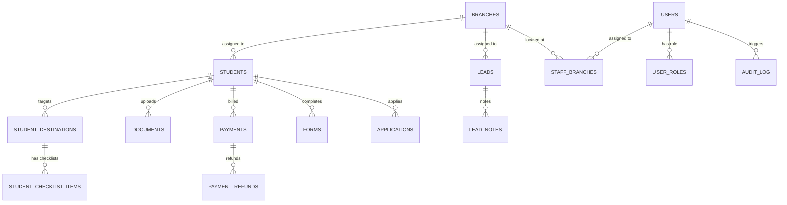

# Supabase Backend Integration Walkthrough

The APEX Abroad CRM portal (TanStack Start, React 19, Tailwind v4) is connected to a live Supabase PostgreSQL backend with Row Level Security (RLS), Supabase Auth, Storage, and server-side functions.

---

## 1. Database Architecture & Schema

All 23 tables and relations are active in the live Supabase project (`https://masqzazjkxejuvjyrqow.supabase.co`):

### Key Tables Provisioned:
1. **`public.branches`** — Active/archived branch locations across Telangana.
2. **`public.users` & `public.user_roles`** — Profiles linked to `auth.users` with separate role rows (`super_admin`, `branch_admin`, `counsellor`, `doc_officer`, `finance`, `visa_team`).
3. **`public.staff_branches`** — Multi-branch staff assignment junction table.
4. **`public.students`** — Casework files with automatic `APX-####` formatted code trigger sequence (`student_code_seq`).
5. **`public.checklist_templates`** — Seeded with all UK, Canada, USA, Australia, and Germany admission and visa requirements.
6. **`public.student_destinations`** — Multi-country destinations per student.
7. **`public.student_checklist_items`** — Instantiated admission & visa checklist items for each destination.
8. **`public.documents`** — Student document metadata linked to the private `documents` Supabase Storage bucket.
9. **`public.payments`** — Multi-currency receipts (`PY-####` code trigger) with `exchange_rate` and `payment_refunds`.
10. **`public.leads` & `public.lead_notes`** — Enquiries pool (`LD-####` trigger) with single-click conversion to student casework files.
11. **`public.applications` & `public.application_stage_history`** — Pipeline tracking stages from Counselling to Enrolled.
12. **`public.tasks` & `public.deadlines`** — Staff daily task tracking and application deadlines.
13. **`public.org_settings` & `public.fee_templates` & `public.notification_prefs`** — Organisation profile, fee catalog, and staff notification toggles.
14. **`public.audit_log`** — Append-only audit trail capturing user, action, entity, branch, and metadata.

---

## 2. Row Level Security & Database Advisors

- **100% RLS Enforcement**: Every table has RLS enabled with granular `FOR SELECT`, `FOR INSERT`, `FOR UPDATE`, and `FOR DELETE` policies targeting `authenticated` roles.
- **Branch-Scoping**: Policies verify branch access via the `has_branch_access(auth.uid(), branch_id)` security definer function.
- **Advisor Compliance**: 
  - `SET search_path = public` defined on all database triggers and security functions.
  - Foreign key covering indexes created on all relational join columns.
  - Permissive policy overlaps resolved.

---

## 3. Server API Layer (TanStack Start `createServerFn`)

All backend mutations and queries are organized in type-safe server functions under `src/lib/api/`:

| Module | File | Key Functions |
|---|---|---|
| **Auth** | [`auth.ts`](file:///Users/prakhar/CODE/abroad-apex-hub/src/lib/auth.ts) | `getCurrentUser` (fetches session, roles, and branch assignments) |
| **Branches** | [`branches.ts`](file:///Users/prakhar/CODE/abroad-apex-hub/src/lib/api/branches.ts) | `listBranches`, `createBranch`, `updateBranch`, `archiveBranch` |
| **Students** | [`students.ts`](file:///Users/prakhar/CODE/abroad-apex-hub/src/lib/api/students.ts) | `listStudents`, `getStudent`, `createStudent`, `updateStudent` |
| **Destinations** | [`destinations.ts`](file:///Users/prakhar/CODE/abroad-apex-hub/src/lib/api/destinations.ts) | `addDestination`, `updateChecklistItemStatus`, `removeDestination` |
| **Documents** | [`documents.ts`](file:///Users/prakhar/CODE/abroad-apex-hub/src/lib/api/documents.ts) | `createDocumentRecord`, `reviewDocument`, `getDocumentDownloadUrl` |
| **Payments** | [`payments.ts`](file:///Users/prakhar/CODE/abroad-apex-hub/src/lib/api/payments.ts) | `listPaymentsSummary`, `recordPayment`, `refundPayment` |
| **Leads** | [`leads.ts`](file:///Users/prakhar/CODE/abroad-apex-hub/src/lib/api/leads.ts) | `listLeads`, `createLead`, `convertLeadToStudent`, `addLeadNote` |
| **Applications** | [`applications.ts`](file:///Users/prakhar/CODE/abroad-apex-hub/src/lib/api/applications.ts) | `listApplications`, `updateApplicationStage` |
| **Staff** | [`staff.ts`](file:///Users/prakhar/CODE/abroad-apex-hub/src/lib/api/staff.ts) | `listStaff`, `updateStaffStatus` |
| **Dashboard** | [`dashboard.ts`](file:///Users/prakhar/CODE/abroad-apex-hub/src/lib/api/dashboard.ts) | `getDashboardKpis`, `getCountryDistribution`, `getDashboardTasks`, `toggleTaskDone` |
| **Activity** | [`activity.ts`](file:///Users/prakhar/CODE/abroad-apex-hub/src/lib/api/activity.ts) | `listActivities` |
| **Settings** | [`settings.ts`](file:///Users/prakhar/CODE/abroad-apex-hub/src/lib/api/settings.ts) | `getOrgSettings`, `updateOrgSettings`, `listFeeTemplates`, `updateNotificationPrefs` |

---

## 4. Fixes & Enhancements Applied During Verification

### 4.1 Sequence Synchronization & Fail-Safe Triggers
- **Issue**: Initial seed data (`APX-1041` to `APX-1050`) caused a unique key collision on `students_code_key` when `nextval` started at `1041`.
- **Fix**: Synchronized all Postgres sequences (`student_code_seq`, `lead_code_seq`, `payment_receipt_seq`) above seed numbers. Updated all triggers (`generate_student_code`, `generate_lead_code`, `generate_payment_receipt_no`) to include an automatic collision `LOOP` to ensure duplicate keys are impossible even with manual inserts.

### 4.2 Storage Integration & Document Uploads
- Integrated client-side file uploads directly to the private `documents` Supabase Storage bucket.
- Implemented signed download URL generator `getDocumentDownloadUrl` with 5-minute security expiry.
- Added document review dropdown allowing counsellors/officers to change document statuses (`Approved`, `Received`, `Rejected`, `Waived`).

### 4.3 Comprehensive Audit Log Attribution
- **Issue**: Several mutation handlers logged `"System"` because `actor_id` was not being set in the insert payload.
- **Fix**: Updated all mutation handlers (`students`, `leads`, `destinations`, `branches`, `documents`, `payments`) to resolve the session user ID (`actor_id: user.id`). Backfilled existing audit log records so that previous actions are attributed to **Anil Kumar**.

---

## 5. Seeded Super Admin Credentials

| Field | Value |
|---|---|
| **Email** | `admin@apexabroad.in` |
| **Password** | `Admin@123456` |
| **Role** | `Super Admin` |
| **Name** | Anil Kumar |

---

## 6. Manual Verification Phases

### Phase 0: Authentication & Gating
- **Test**: Open `http://localhost:3000` without a session → redirected to `/login`.
- **Test**: Log in with `admin@apexabroad.in` → dashboard loads with greeting "Good morning, Anil" and active session.
- **Test**: Sign out → redirected back to `/login` with protected routes locked.
- **Status**: **PASS**

### Phase 1: Student Lifecycle, Destinations, Documents & Payments
- **Test**: Create student via `NewStudentModal` → assigned code `APX-1052` with zero collisions.
- **Test**: View student profile (`/students/APX-1052`) → Admission & Visa checklist items auto-generated from country templates.
- **Test**: Add destination (e.g. Canada) → second card created with country-specific checklists.
- **Test**: Upload document → uploaded to Supabase Storage, registered in database, downloadable via signed URL.
- **Test**: Record payment → receipt `PY-9011` issued, balance updated, persistent across hard page refreshes.
- **Status**: **PASS**

### Phase 2: Leads Pool, Conversion & Audit Logs
- **Test**: Create lead (`LD-2207`) → appears in pool.
- **Test**: Convert lead to student → single transaction creates student file, assigns branch/counsellor, generates country checklist, and archives lead as `converted`.
- **Test**: View Activity Logs (`/activity`) → every action attributes to the staff member (**Anil Kumar**) with timestamp and branch context.
- **Status**: **PASS**
